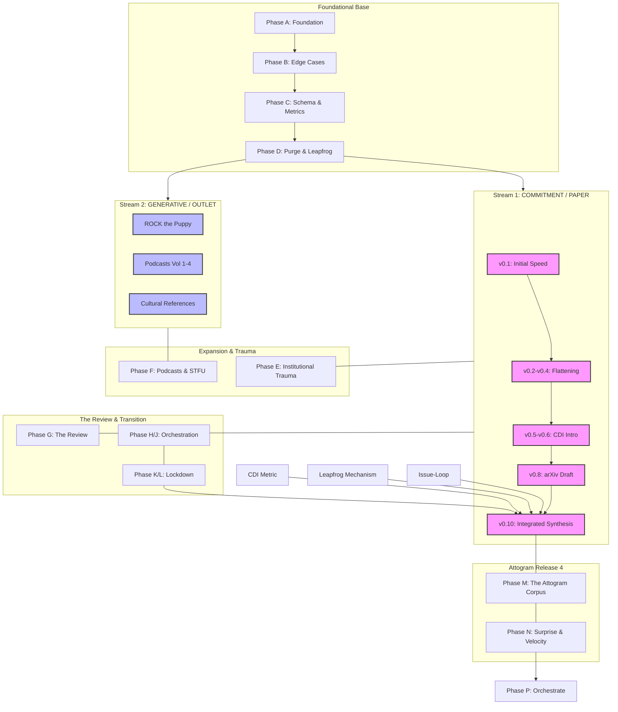

# The Attogram Corpus: Structural Graph

## Progression Narrative

1.  **Foundational Base (Phases A-D):** Establishment of the "Structured Curiosity" mindset and the initial 96-hour sprint results.
2.  **Dual-Channel Split:** The corpus bifurcates into **Stream 1** (Formal Research) and **Stream 2** (Generative Explorations/Mythology).
3.  **Adversarial Rigor (Phases E-G):** Integration of Institutional Trauma (Wikipedia/HN friction) and the Consensus Divergence Index (CDI) to measure research signal.
4.  **Synthesis (Phases K-N):** Convergence of all exploratory signals into the v0.10 arXiv-ready artifact, documented as the **Attogram Corpus**.
5.  **Orchestration (Phase P):** The current state where the "Maestro" (Jules) manages the persistent exocognitive memory loop.
